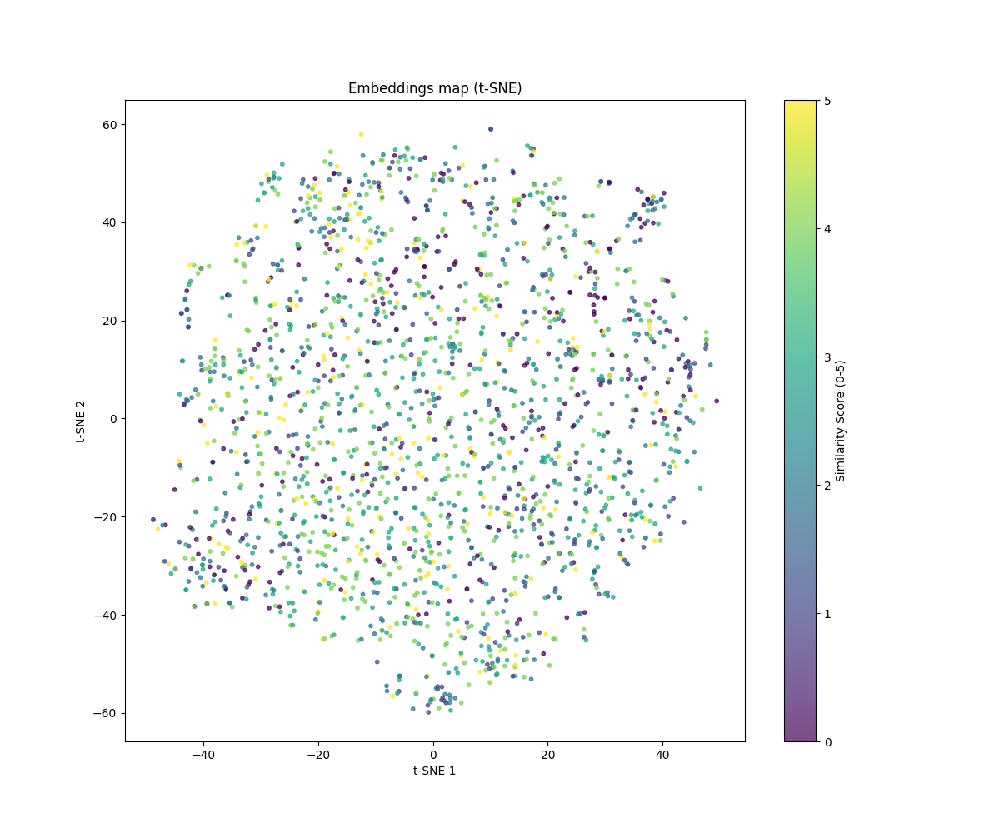

# Lightweight Sentence Embedding Model
Link to the competition: Link to this competition: https://huawei.agorize.com/en/challenges/2025-poland-tech-arena

This repository contains a submission for the sentence embedding challenge. The goal is to produce a lightweight (≤ 20MiB) and efficient model that converts variable-length, token-level embeddings into a single, fixed-size sentence embedding for similarity comparison.

This solution uses a custom **hybrid-pooling** encoder trained with a **two-phase strategy** (contrastive pre-training followed by regression fine-tuning) to create robust and accurate sentence representations.

## 📊 Embedding Visualization (t-SNE)

The t-SNE plot below visualizes 2,000 sentence embeddings from our dataset, flattened from 256 dimensions down to 2. The color of each point corresponds to its similarity label (from 0.0 to 5.0).



**Key Observation:** The points are highly mixed in terms of color, rather than being segregated.

**What does this mean?** This is a desirable outcome. It demonstrates that the model **did not learn to group sentences based on their similarity score**. Instead, it is creating a true semantic space where a sentence's location is determined by its **meaning**. For example, two sentences about sports will land near each other, regardless of whether one had a similarity score of 0.5 and the other had a score of 4.5.

## 🚀 Model Architecture (`model.py`)

The core of this solution is the `SentenceEncoder` module. Instead of relying on simple mean or max pooling, it uses a custom-weighted combination of **Attention Pooling** and **Mean Pooling** to capture richer semantic information.

The model's forward pass consists of the following steps:

1.  **Input Projection:** The input token embeddings `(Batch, Tokens, 768)` are first projected down to a smaller hidden dimension `(Batch, Tokens, 128)`. This is done by a Linear layer, followed by LayerNorm and a GELU activation. This step reduces complexity and learns a more compact representation.
2.  **Parallel Pooling:** Two pooling strategies are computed simultaneously:
    * **Attention Pooling:** A learnable, token-wise attention mechanism is applied. The model learns to assign higher weights to more important tokens (e.g., keywords) and computes a weighted sum.
    * **Mean Pooling:** A standard masked mean pooling is computed, providing a stable, holistic representation of the sentence.
3.  **Hybridization:** The two pooled outputs are combined using a fixed weighted average:
    `pooled = (0.7 * attention_pooled) + (0.3 * mean_pooled)`
    This hybrid approach captures the stability of mean pooling while benefiting from the focus of learned attention.
4.  **Final Projection:** The combined `(Batch, 128)` vector is passed through a final projection layer to produce the output embedding `(Batch, 256)`.
5.  **L2 Normalization:** The final output vector is **L2-normalized**. This makes the embeddings live on the surface of a hypersphere, making them ideal for comparison using cosine similarity.

## 🏃‍♂️ How to Train

To replicate the training process from scratch:

1.  **Download the Data**
* Download the official competition dataset from [this link](https://techarena2025.xianti.fr/static/TechaArena_Poland_2025.zip).
* Unzip and place the `data` folder (containing `.dat` files) in the root of this repository.

2.  **Install Requirements**
* Ensure you have `torch` and `numpy` installed (see `## 📋 Requirements` below).

3.  **Run Training**
* Execute the main training script:
    ```bash
    python train.py
    ```
* The script will run for `TOTAL_EPOCHS` (100 by default) and automatically save the best-performing model as `model.bin`.

## 🏋️‍♂️ Training Strategy (`train.py`)

The model is trained using a sophisticated two-phase approach to maximize performance. This allows the model to first learn a good general understanding of sentence structure and then specialize in the specific similarity-scoring task.

### Phase 1: Contrastive Pre-training (Epochs 1-20)

* **Goal:** To learn a semantically meaningful embedding space where similar sentences are naturally closer together.
* **Loss Function:** **NT-Xent Loss** (`nt_xent_loss`).
* **Method:** This is a self-supervised, contrastive learning technique. For each pair of sentences (`s1`, `s2`) in the batch, it treats them as a "positive pair."
    * It **pulls** the embeddings `emb(s1)` and `emb(s2)` together.
    * It **pushes** `emb(s1)` and `emb(s2)` away from all *other* sentence embeddings in the batch (the "negative samples").
* **Note:** The 0-5 similarity labels are **not** used during this phase.

### Phase 2: Fine-Tuning (Epochs 21-100)

* **Goal:** To adapt the pre-trained encoder to the specific 0-5 similarity score (a regression task).
* **Loss Function:** A combined loss:
    1.  **Cosine Similarity Loss:** The primary loss is an **MSE** between the model's predicted similarity and the true label. Both are scaled to a `[0, 1]` range before comparison:
        * `prediction = (F.cosine_similarity(emb1, emb2) + 1.0) / 2.0`
        * `target = labels / 5.0`
    2.  **Hard Negative Margin Loss:** To prevent the model from "collapsing" and to improve its discriminative power, a hard negative mining loss (`hard_negative_margin_loss`) is added every 2 batches. This loss finds the *most similar* negative sample in the batch and ensures it is pushed away from the anchor sentence by a specified margin.

---

### ⚙️ Other Training Details

* **Optimizer:** `torch.optim.AdamW`
    * Learning Rate: `0.0004`
    * Weight Decay: `0.00005`
* **Scheduler:** `CosineAnnealingWarmupLR`
    * **Warmup:** 3 epochs (linear increase from 0 to `0.0004`)
    * **Annealing:** 97 epochs (cosine decay from `0.0004` down to `1e-6`)
* **Hyperparameters:**
    * `BATCH_SIZE`: 64
    * `TOTAL_EPOCHS`: 100
    * `GRAD_ACCUMULATION_STEPS`: 1
    * `GRAD_CLIP_NORM`: 1.0

## 📦 Submission & Usage

This submission adheres to the competition requirements.

* **Model File (`model.py`):** Provides the `get_model()` function, which returns an instance of the `SentenceEncoder` module.
* **Weights File (`model.bin`):** This file contains the trained `state_dict` of the model. It is the checkpoint from the epoch that achieved the **lowest validation loss** during training.
* **Model Size:** The resulting `model.bin` file is **< 1MB**, well below the 20MiB limit.
* **Inference:** The model correctly handles batched input with variable sequence lengths and zero-padding, as specified by the `(batch, seq_len, 768)` input shape.

### 🚀 Usage Example

Here is how to load the trained model and run inference on a batch of data:

```python
import torch
from model import get_model 

# 1. Initialize the model architecture
# Make sure model.py is in the same directory
model = get_model() 

# 2. Load the trained weights
# We use map_location='cpu' to ensure it runs on any machine
model.load_state_dict(torch.load("model.bin", map_location=torch.device('cpu')))

# 3. Set the model to evaluation mode (disables dropout, etc.)
model.eval()

# 4. Create dummy input data (Batch_Size=2, Tokens=10, Dim=768)
dummy_data_1 = torch.rand(2, 10, 768)
dummy_data_2 = torch.rand(2, 8, 768) 

# 5. Pad the data (simulate the collate_fn)
padded_data = torch.nn.utils.rnn.pad_sequence(
    [dummy_data_1[0], dummy_data_2[0]], 
    batch_first=True, 
    padding_value=0
)

# 6. Run inference
with torch.no_grad():
    embeddings = model(padded_data)

print(f"Successfully loaded model.")
print(f"Input batch shape: {padded_data.shape}")
print(f"Output embeddings shape: {embeddings.shape}")
```
## 📋 Requirements

This model was trained and is compatible with the following dependencies, as per the competition rules:

* `python == 3.12`
* `torch == 2.3.0`
